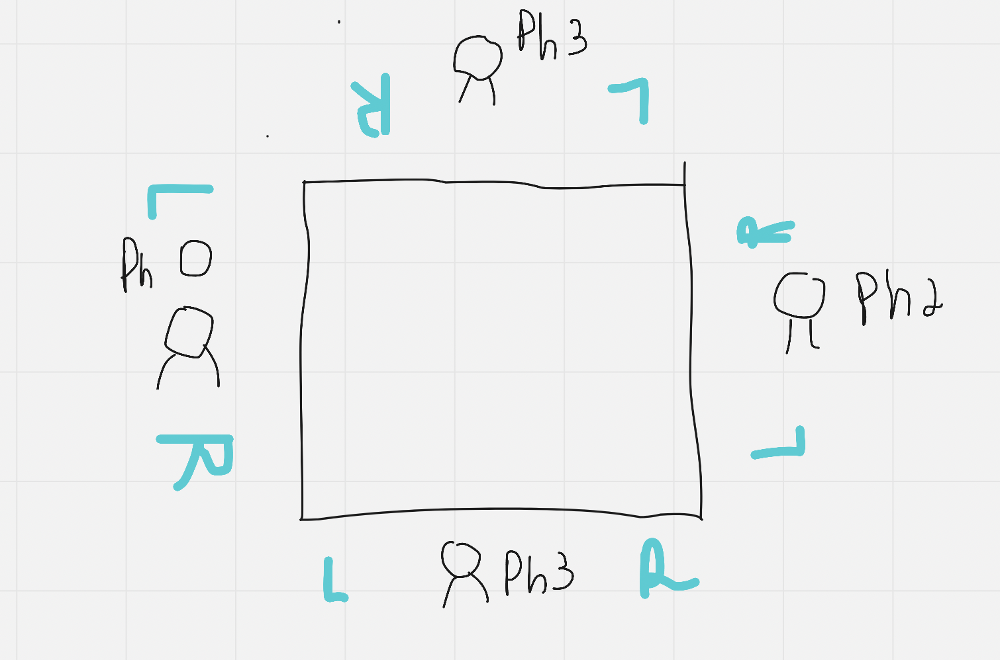

# Dining Philosophers Problem

--- English ---

Five silent philosophers sit at a round table with bowls of spaghetti. Forks are placed between each pair of adjacent philosopher. Each philosopher must alternately think and eat. However, a philosopher can only eat spaghetti when they have both left and right forks. Each fork can be held by only one philosopher and so a philosopher can use the fork only if it is not being used by another philosopher. After an individual philosopher finishes eating, they need to put down both forks so that the forks become available, but cannot start eating before getting both forks. Eating is not limited by the remaining amounts of spaghetti or stomach space.

--- Portuguese ---

Cinco filosósofos silenciosamente sentaram-sem em uma mesa com vasilias de macarrão. Garfos foram colocados entre cada par de filosófos adjacentes. Cada filosófo deve alternar entre pensar e comer. Entretanto, um filosofo deve comer macarrão quando elel possuir o garfo da direita e o da esquerda. Cada garfo pode ser possuido por somente um filosófo e o filosófo só poderá utilizar o garfo caso não esteja sendo utilizado por mais nenhum outro. Após o filosófo terminar de comer ele precisa desocupar ambos os garfos e então os garfos ficam disponíveis novamente, porém não pode comer sem antes possuir os dois. Comer não está limitado a quantidade restante de macarrão ou espaco disponível no estomago. 

-----

## Resolution (Resolucao)

1) Every philosophers are seated down with the left and right hands free
